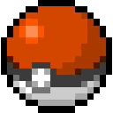
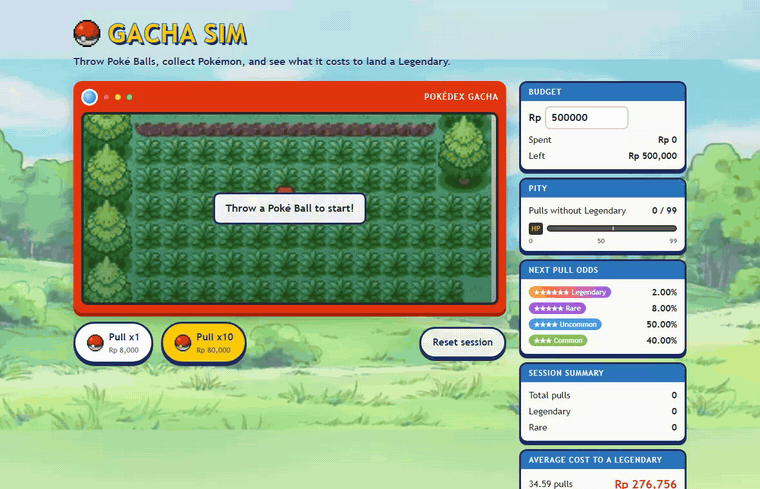
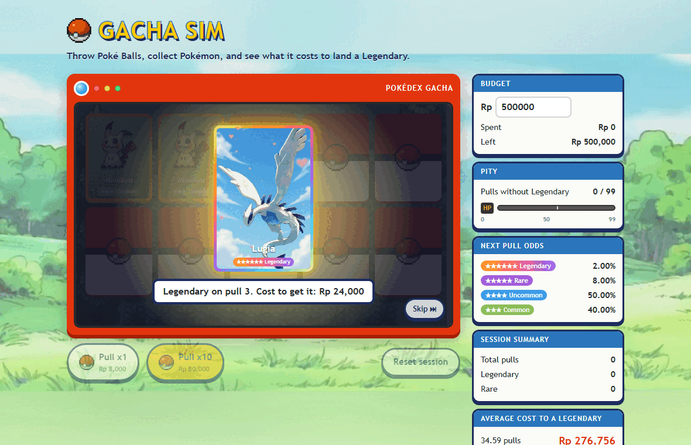
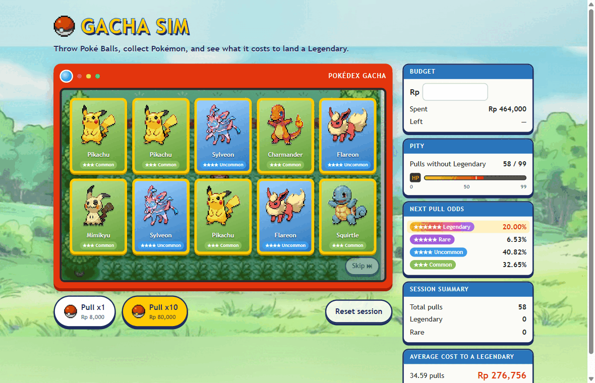
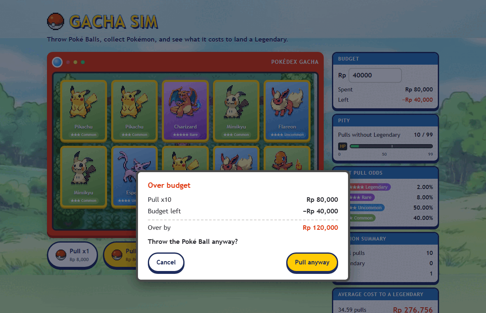

<p align="center">
  
</p>

<h1 align="center">Gacha Sim</h1>

<p align="center">
  <b>Throw Poké Balls, collect Pokémon, and see what it really costs to land a Legendary.</b>
</p>

<p align="center">
  <a href="https://cicilicienye323.github.io/gacha-sim-lin/"></a>
</p>

<p align="center">
  
</p>

Gacha games show you the drop rate. They rarely show you the bill. Gacha Sim runs the real
math of a pity-based banner in your browser and keeps a running total in rupiah, so every
pull has a price tag next to it.

## What you can do

- **Pull x1 or x10.** Cards open one at a time, and a Legendary gets its own spotlight.
- **Watch the odds move.** The *Next pull odds* panel updates after every pull as pity builds up.
- **Set a budget.** Go over it and the game stops to ask first. You can still pull anyway.
- **Skip** the animation whenever you want the results right away.
- **Compare with the average.** A Legendary costs 34.59 pulls on average. Your session shows how lucky you were.

<table>
  <tr>
    <td width="33%"></td>
    <td width="33%"></td>
    <td width="33%"></td>
  </tr>
  <tr>
    <td align="center"><sub><b>Legendary spotlight</b><br>with the pull number and what it cost</sub></td>
    <td align="center"><sub><b>Pity zone</b><br>58 pulls in, the Legendary rate is already 20%</sub></td>
    <td align="center"><sub><b>Over budget</b><br>the game asks before you overspend</sub></td>
  </tr>
</table>

## How the odds work

| Tier | Base rate | Pool |
|---|---|---|
| ★★★★★★ Legendary | 2% | Rayquaza, Groudon, Lugia, Shiny Rayquaza |
| ★★★★★ Rare | 8% | Mew, Charizard, Gengar |
| ★★★★ Uncommon | 50% | Leafeon, Flareon, Sylveon, Espeon, Umbreon |
| ★★★ Common | 40% | Pikachu, Squirtle, Charmander, Mimikyu |

**Pity.** Pulls 1 to 50 use the base rates. From pull 51 without a Legendary, its rate climbs
by 2% per pull, so pull 99 is a guaranteed Legendary. The other tiers shrink in proportion
to keep the total at 100%.

| Pulls without a Legendary | Next pull is a Legendary |
|---|---|
| 0 to 49 | 2% |
| 50 | 4% |
| 58 | 20% |
| 89 | 82% |
| 98 | 100% |

**Price.** One pull costs Rp 8,000. Money is always counted in whole rupiah.

**The average.** The expected number of pulls to the first Legendary is the sum of
*n × P(first Legendary on pull n)* for n = 1 to 99. That comes to **34.59 pulls,
or Rp 276,756**. A test checks this number against the rate formula, so the two never drift apart.

## Run it locally

```bash
npm install
npm run dev     # http://localhost:5173/
npm test        # unit tests
```

`npm run build` produces the GitHub Pages build under `/gacha-sim-lin/`. Every push to `main`
is built, tested, and deployed by [GitHub Actions](.github/workflows/pages.yml).

## Under the hood

| Part | Choice |
|---|---|
| App | Vite and TypeScript, no UI framework. The whole script is under 9 kB |
| Gacha rules | [`src/gacha.ts`](src/gacha.ts): pure functions with the random source passed in, so every rule is testable |
| Pokémon picker | [`src/pokemon.ts`](src/pokemon.ts): reuses the same random number as the tier roll, so one pull is always one random draw |
| Screen | [`src/main.ts`](src/main.ts) and [`src/style.css`](src/style.css): Pokédex frame, trading-card layout, HP-style pity bar |
| Tests | Vitest for the rules, Playwright for the screen |
| Hosting | GitHub Pages |

## Credits

Pokémon and all related names and artwork belong to Nintendo, Game Freak, and The Pokémon
Company. Sprites and artwork were collected from Pinterest for this personal, non-commercial
fan project.
